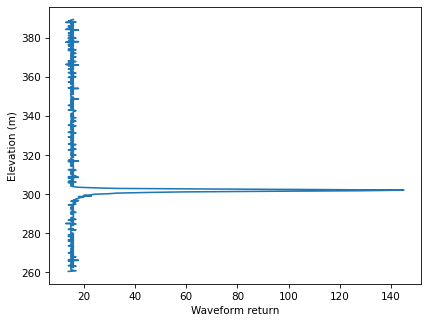
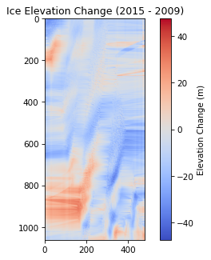

# Mapping the Pine Island Galcier

The task was to develop a python script, capable of comparing elevation change between two datas. In this case using Lidar Data to map data from LVIS (Land, Vegetation and Ice Sensor) 2009 and 2015. 

## Geting Started

These instructions will get you a copy of the project up and running on your laptop to run and test the code.

### Prerequisites
All of the libraries used in this project are already installed in Edinburgh University Scotia environment.
If you do encounter any errors you can install them using the following commands.
```
pip install <library_name>
```

### Installing
To install the project, you need to clone the repository using the command:
```
git clone git@github.com:edinburgh-university-OOSA/final-assessment-freddiegi02.git
```
Then, navigate to the final-assessment-freddiegi02 directory using the cd command

## Layout of the project
```
│── src/
│   │── handleTiff.py
│   │── processLVIS.pyV
│   │── tiffEample.py
│── display.py
│── lvisClass.py
│── README.md
│── Task1.py
│── Task2.py
│── Task3.py
│── Task5.py
│── LVIS2009/
│   │── Datasets/
│   ├── GeoTIFF/
│── LVIS2015/
│   ├── Datasets/
│   ├── GeoTIFF/
```
The src directory contains the scripts were provided.
The display.py script is used to display the data. 
The README.md file contains the instructions for running the code.
Task 1 - 5 are the scripts that were used to process the data and where the code sould be run from.
The LVIS2009 and LVIS2015 directories are where the scripts will export the datasets and Geotiff to.

### Running the code
To run the code you will need to use a python command line parser for each task.

For Task 1, run the following command:
```
python Task1.py --filename /geos/netdata/oosa/assignment/lvis/2015/ILVIS1B_AQ2015_1012_R1605_070498.h5 --waveform 30 
```
This will run the code in the Task1.py file and display the following output:



For Task 2, run the following command:
```
python Task2.py --filename  /geos/netdata/oosa/assignment/lvis/2009/ILVIS1B_AQ2009_1020_R1408_061398.h5 --res 30 --year 2009
```
This will run the code in the Task2.py file and display the following output: 


For Task 3, run the following command:

```
python Task3.py --folder /geos/netdata/oosa/assignment/lvis/2015 --res 30 --year 2015
```
This will run the code in the Task3.py file and display the following output:


 

For Task 4, run the following command:
```
python Task4.py 
```
This will run the code in the Task4.py file and display the following output:




### Version
Python 3.11.9
